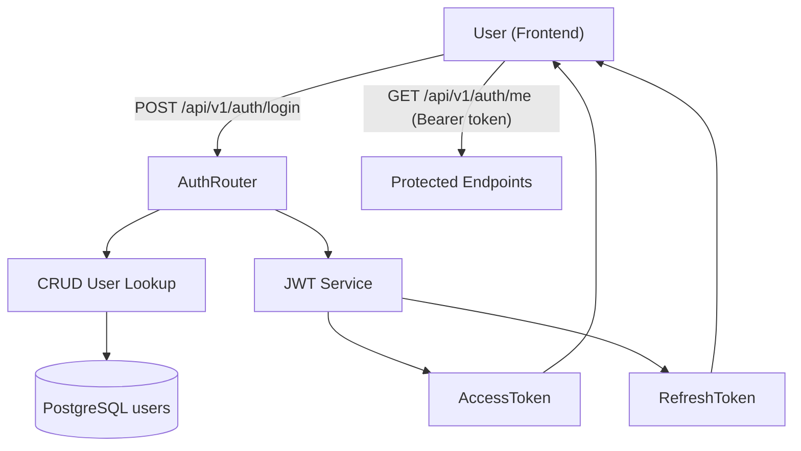
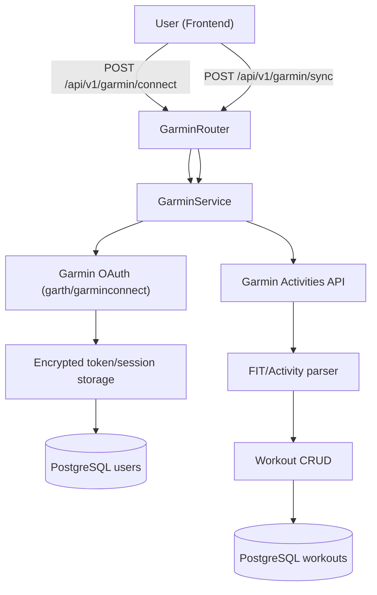
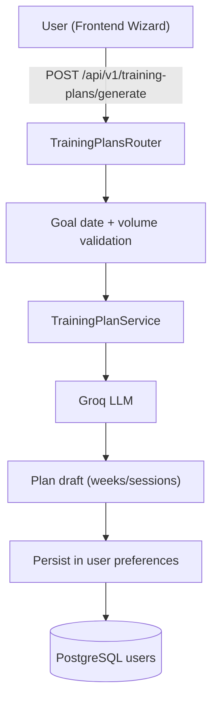

# RunCoach AI - Intelligent Running Platform

**Repository:** [github.com/Guille1799/plataforma-running](https://github.com/Guille1799/plataforma-running)  
**Live (demo / evolving):** [plataforma-running.vercel.app](https://plataforma-running.vercel.app)

RunCoach AI is a full-stack application that turns workout and health data into actionable training decisions:
session analysis, personalized plans, and adaptive coaching guidance. It links **Garmin** and **Strava** to a **FastAPI** + **PostgreSQL** backend and **LLM**-assisted planning (**Groq**, Llama 3.3)—useful as a portfolio example of **behaviour change** tooling grounded in real activity data, not generic chat.

## How It Works (First)

### 1) Authentication Flow



### 2) Garmin Sync Flow



### 3) Training Plan Flow



### 4) Data Model Distinction

- **Race catalog**: seeded dataset used for race search and planning (e.g., 52 races).
- **User workouts**: personal training history synced/uploaded by each athlete (could be 52, 200, etc.).
- These are different datasets and should never be interpreted as the same count.

## Problem It Solves

- Centralizes fragmented data sources (Garmin, GPX/FIT files, athlete profile) into one product.
- Converts raw metrics into training decisions, not just dashboards.
- Supports goal planning (5K/10K/half marathon/marathon) with adaptation based on real progress.

## Technology Stack

**Frontend**
- Next.js 16 (App Router)
- React 19 + TypeScript 5
- Tailwind CSS 4
- Recharts 3

**Backend**
- FastAPI (Python 3.11)
- PostgreSQL 15
- SQLAlchemy 2
- Celery + Redis

**AI and Integrations**
- Groq (Llama 3.3 70B)
- Garmin Connect (OAuth 2.0)
- Strava (OAuth 2.0)

## Quality and CI

- CI validates backend (tests) and frontend (lint, typecheck, build).
- Recommended command before opening a PR:

```powershell
npm run check
```

## Quick Start (Local Setup)

```powershell
# 1) Clone and enter project
git clone https://github.com/Guille1799/plataforma-running.git
cd plataforma-running

# 2) Configure environment
Copy-Item .env.example .env

# 3) Start backend + frontend
.\start-dev.ps1
```

URLs:
- Frontend: http://localhost:3000
- Backend API: http://localhost:8000
- Swagger: http://localhost:8000/docs

Stop services:

```powershell
.\stop-dev.ps1
```

## Production Demo Note

- Demo deployment uses free-tier hosting (Vercel + Render).
- First request after inactivity may be slow due to cold start (expected behavior).
- For an always-reliable review, use local startup (`.\start-dev.ps1`) and the architecture/flow docs linked below.
- **Demo login:** when `NEXT_PUBLIC_DEMO_EMAIL` and `NEXT_PUBLIC_DEMO_PASSWORD` are set (see `.env.example`), the login page shows that account with copy buttons and one-click sign-in for recruiters and evaluators.
- **Local setup:** copy `demo-account.env.example` to `demo-account.env` (gitignored), put your demo user email and password there, then run `.\scripts\write-demo-login-env.ps1` to merge them into `.env.local`. For Vercel, add the same two variables in Project → Settings → Environment Variables (Production).

## Recommended Documentation

- End-to-end explanation (Auth, Garmin, Plans): [`docs/HOW_IT_WORKS.md`](docs/HOW_IT_WORKS.md)
- Engineering guides index: [`docs/guides/README.md`](docs/guides/README.md)
- Full architecture: [`docs/guides/ARCHITECTURE.md`](docs/guides/ARCHITECTURE.md)
- Features and workflows: [`docs/guides/FEATURES_AND_WORKFLOWS.md`](docs/guides/FEATURES_AND_WORKFLOWS.md)
- Operational startup: [`README_STARTUP.md`](README_STARTUP.md)
- Server troubleshooting: [`docs/START_SERVERS.md`](docs/START_SERVERS.md)
- Operations and deployment: [`docs/README.md`](docs/README.md)

## Collaboration

- Contribution guide: [`CONTRIBUTING.md`](CONTRIBUTING.md)
- Security policy: [`SECURITY.md`](SECURITY.md)
- PR template: [`.github/pull_request_template.md`](.github/pull_request_template.md)
- License: [`LICENSE`](LICENSE)

## Author

**Guillermo** - [@Guille1799](https://github.com/Guille1799)
