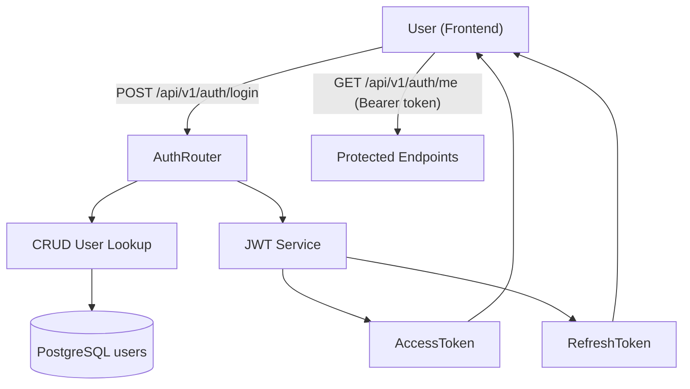
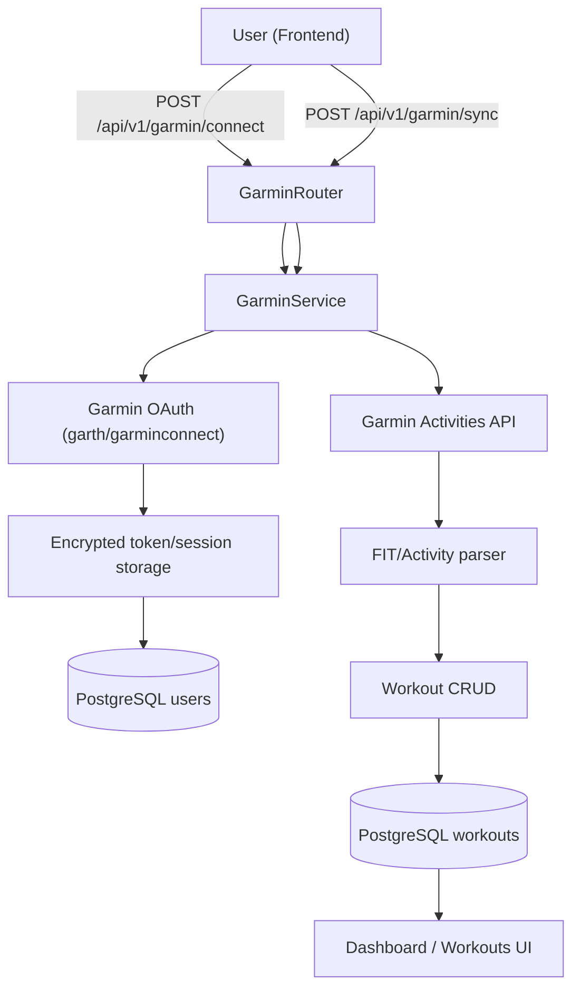
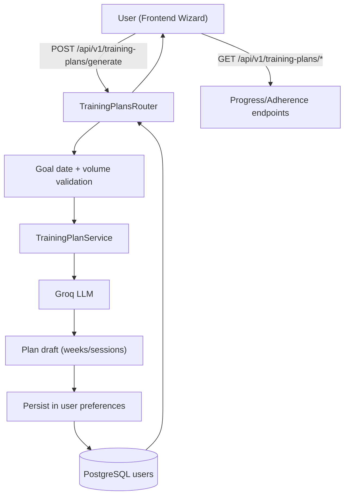
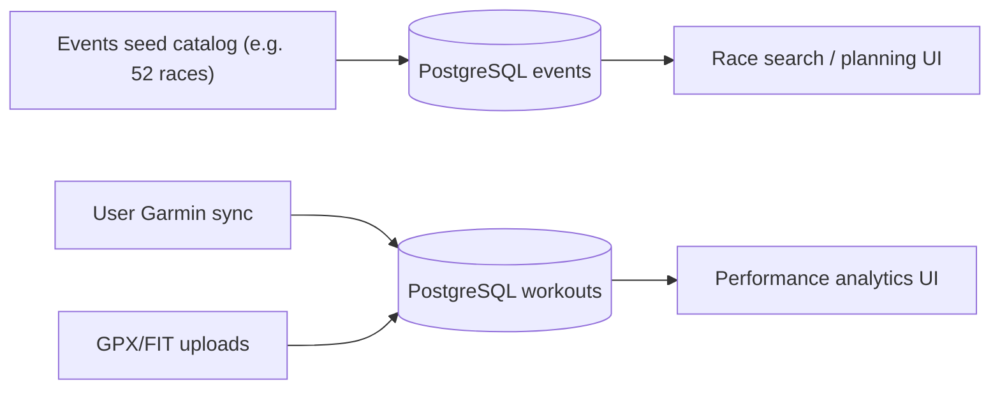

# How It Works (End-to-End)

A quick-read document to understand the product logic in a few minutes.

## 1) Authentication Flow

Key points:
- The system issues `access_token` and `refresh_token`.
- `refresh_token` supports session renewal without forcing a new login.
- Protected routes rely on the authenticated-user dependency.

## 2) Garmin Sync Flow

Key points:
- Connect and sync are two different steps.
- Sync persists user workouts (personal training history).
- Connection/sync status is available via `GET /api/v1/garmin/status`.

## 3) Training Plan Flow

Key points:
- Plans are generated from goal + target date + current weekly volume.
- Target date is validated before generation.
- Users can list, adapt, and track adherence/progress.

## 4) Data Model Distinction (Important)

- **Events/Races**: catalog used to explore and select goals.
- **Workouts**: real athlete training history.
- If both counts happen to be 52 at some point, that is coincidence, not a data relation.
